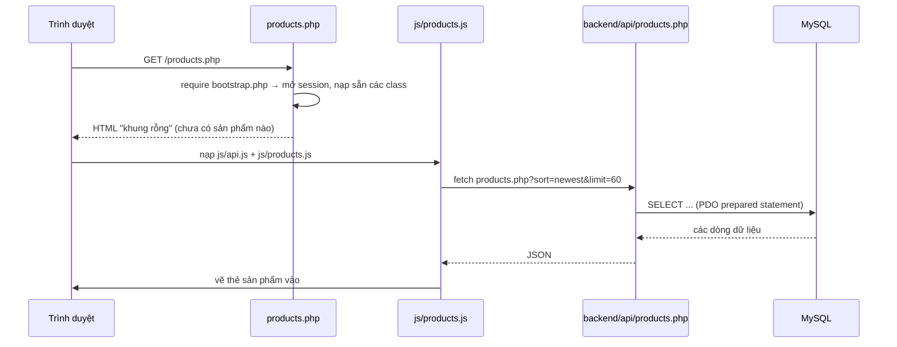

# TNC Store — Tài liệu kiến trúc & hướng dẫn đọc code

> Tài liệu này viết cho người **đã biết C, C# và Python** nhưng chưa quen PHP/JavaScript.
> Những chỗ cần thiết sẽ có so sánh với khái niệm tương đương trong C#/Python để bạn bám vào.

---

## 1. Bức tranh lớn — website này chạy như thế nào?

Không có bước **build**. Không dùng framework. Không có process chạy thường trú.

- **PHP** giống một *controller* trong ASP.NET hay một *route* trong Flask, nhưng khác ở chỗ:
  - **Không biên dịch trước.** Mỗi request, PHP đọc file `.php`, dịch rồi chạy luôn.
  - **Không có `main()`.** Mỗi request vào một file nghĩa là "chương trình" chạy từ dòng đầu tới dòng cuối file rồi kết thúc. Biến toàn cục **không tồn tại** giữa hai request (giống hệt việc mỗi request là một lần chạy `python app.py` mới).
  - `<?php ... ?>` là các "lỗ" để nhúng code vào HTML. Phần nằm ngoài các thẻ đó được in thẳng ra response.
  - `require_once` giống `using`/`import`: nạp file khác vào. `_once` để không nạp hai lần.
- **JavaScript** chạy trong trình duyệt, gọi API bằng `fetch` rồi tự dựng HTML.

### Luồng đầy đủ khi mở trang sản phẩm



**Điểm mấu chốt cần nhớ:** HTML mà PHP trả về gần như **rỗng**. Toàn bộ sản phẩm, tin tức, số liệu admin đều do JavaScript gọi API rồi vẽ ra. Vì vậy bạn sẽ thấy chữ "Đang tải..." — đó là trạng thái chờ, xem mục 7.3.

Hệ quả: nếu bạn chỉ `curl products.php` thì sẽ **không** thấy sản phẩm nào. Phải xem trong trình duyệt, hoặc gọi thẳng API.

---

## 2. Cây thư mục và vai trò từng nhóm

```
Btl-php/
├── *.php                    ← 17 "trang" (mỗi URL là một file)
├── partial/                 ← các mảnh HTML dùng chung
│   ├── header.php           ← menu, logo, ô tìm kiếm, giỏ hàng nhỏ
│   ├── footer.php           ← chân trang + nạp js/api.js, js/cart.js
│   └── link.php             ← các thẻ <link>/<script> của Bootstrap, font, css
├── js/                      ← toàn bộ JavaScript phía trình duyệt
├── css/style.css            ← toàn bộ CSS (một file duy nhất, khá dài)
├── assets/                  ← ảnh, banner, ảnh sản phẩm
└── backend/                 ← "server side": không truy cập trực tiếp từ URL
    ├── bootstrap.php        ← điểm khởi động chung cho mọi request
    ├── config/              ← cấu hình kết nối DB (.env, ca.pem)
    ├── api/                 ← các endpoint trả JSON
    ├── auth/                ← đăng nhập / đăng ký
    ├── database/            ← schema.sql, seed.sql, apply.php
    └── src/                 ← code dùng chung (repositories, support)
```

| Thư mục | Nhiệm vụ | Tương tự trong C#/Python |
| --- | --- | --- |
| `*.php` (gốc) | Trả HTML cho từng URL | Controller + View gộp làm một |
| `partial/` | HTML dùng lại nhiều trang | Layout / Partial View |
| `js/` | Gọi API + dựng giao diện | Front-end SPA thu nhỏ |
| `backend/api/` | Endpoint JSON | Minimal API controller |
| `backend/src/Repositories/` | Truy vấn DB | Repository / DAO pattern |
| `backend/src/Support/` | Hàm tiện ích dùng chung | Utility / Helpers |
| `backend/database/` | Định nghĩa & dữ liệu DB | Migrations + seed data |

---

## 3. Điểm khởi động — `backend/bootstrap.php`

Mọi file PHP ở gốc đều bắt đầu bằng:

```php
require_once __DIR__ . '/backend/bootstrap.php';
```

Hãy coi `bootstrap.php` như `Startup.cs` trong ASP.NET: nó chạy trước, chuẩn bị mọi thứ.

Nó làm 4 việc:

1. **Khai báo đường dẫn** — `BACKEND_PATH`, `PROJECT_PATH` (giống `__file__`/`Path(__file__)`).
2. **Đọc file `.env`** — hàm `loadEnvironment()` tự viết, đọc từng dòng `KEY=VALUE` và gọi `putenv()`.
   Tương đương `python-dotenv`, nhưng tự viết cho khỏi phụ thuộc thư viện.
   Lưu ý: nó **chỉ set biến nếu biến đó chưa tồn tại** trong môi trường. Nhờ vậy bạn có thể ghi đè `.env` bằng biến môi trường thật (dùng nhiều khi test).
3. **Mở session** — `session_name('tnc_store_session'); session_start();`
   Session là "bộ nhớ của server gắn với một trình duyệt", dùng để nhớ đăng nhập. Giống `HttpContext.Session`.
4. **Nạp sẵn code dùng chung** bằng `require_once`:
   `config/database.php`, `src/Support/Http.php`, và 4 repository.

Sau `bootstrap.php`, mọi thứ trong `backend/` đã sẵn sàng để dùng.

---

## 4. Tầng dữ liệu

### 4.1 `config/database.php` — kết nối PDO

`PDO` là lớp truy cập DB chuẩn của PHP → tương đương `DbConnection`/`SqlConnection` trong C# hoặc `sqlite3`/`psycopg` trong Python.

```php
$db = database();   // trả về một đối tượng PDO dùng chung
```

Hàm `database()` dùng `static $connection` để **chỉ tạo kết nối một lần** trong một request (giống biến `static` trong hàm C, hoặc `functools.lru_cache`).

Cấu hình lấy từ `.env`: `DB_HOST`, `DB_PORT`, `DB_DATABASE`, `DB_USERNAME`, `DB_PASSWORD`, và tuỳ chọn `DB_SSL_CA` + `DB_SSL_VERIFY` cho kết nối TLS.

Ba tuỳ chọn quan trọng khi tạo PDO:

| Tuỳ chọn | Ý nghĩa |
| --- | --- |
| `ERRMODE_EXCEPTION` | Lỗi SQL ném exception (giống C#), thay vì trả `false` im lặng |
| `DEFAULT_FETCH_MODE => FETCH_ASSOC` | Mỗi dòng trả về dạng mảng kết hợp `['id' => 1, ...]` (giống `dict` trong Python) |
| `EMULATE_PREPARES => false` | Dùng prepared statement thật của MySQL — xem cảnh báo bên dưới |

> ⚠️ **Bẫy đã từng gặp:** khi `EMULATE_PREPARES = false`, **không được dùng lại cùng một tham số có tên nhiều lần** trong một câu SQL. Ví dụ `WHERE a LIKE :q OR b LIKE :q` sẽ lỗi; phải đặt `:q1`, `:q2`. Đây là lỗi thật đã gặp và đã sửa trong `ProductRepository::buildFilters()`.

### 4.2 `src/Repositories/` — nơi duy nhất chứa SQL

Đây là **Repository pattern**: tầng API không viết SQL, chỉ gọi hàm của repository.

```php
final class ProductRepository {
    public function __construct(private readonly PDO $db) {}
    public function featured(int $limit = 4): array { /* SELECT ... */ }
}
```

`private readonly PDO $db` là *constructor property promotion* — cú pháp gọn của PHP 8, tương đương:

```csharp
public ProductRepository(PDO db) { this.db = db; }   // C#
```

Bốn repository:

| Repository | Phụ trách | Bảng chính |
| --- | --- | --- |
| `ProductRepository` | Danh mục, tìm kiếm, lọc, chi tiết sản phẩm | `products`, `brands`, `categories`, `product_images`, `product_specifications`, `inventory` |
| `NewsRepository` | Danh sách & chi tiết bài viết | `news_posts`, `news_categories` |
| `DashboardRepository` | Số liệu cho trang quản trị | `orders`, `order_items`, `users`, `inventory` |
| `UserRepository` | Tìm user theo email (cho đăng nhập) | `users`, `roles` |

**Mọi truy vấn đều dùng prepared statement** (`prepare()` + `bindValue()`), tức là tham số được gửi tách khỏi câu SQL → chống SQL injection. Đây là lý do không bao giờ nối chuỗi kiểu `"... WHERE slug = '" . $slug . "'"`.

Điểm đáng chú ý: repository **không trả về dòng thô của DB**, mà trả về mảng đã được "trình bày lại" qua `presentOne()`. Ví dụ DB lưu `unit_price = 3200000.00`, còn API trả về cả hai:

```json
{ "price": 3200000, "priceText": "3.200.000 đ" }
```

Nhờ vậy front-end không cần biết quy tắc định dạng tiền Việt Nam. Sản phẩm giá `0` trả về `"Liên hệ"`.

### 4.3 `src/Support/Http.php` — tiện ích cho request/response

- `requestInput()` — đọc dữ liệu gửi lên, hiểu cả form thường lẫn JSON.
- `jsonResponse($payload, $status)` — in JSON rồi `exit`.
- `apiError($e)` — biến exception thành JSON lỗi: `422` nếu là lỗi dữ liệu, `503` nếu là lỗi kết nối DB.

---

## 5. Tầng API — `backend/api/`

Mỗi file ở đây là một endpoint JSON. Cấu trúc chung chỉ có 5 dòng:

```php
require_once __DIR__ . '/../bootstrap.php';
try {
    $repository = new ProductRepository(database());
    // ... đọc $_GET, gọi repository
    jsonResponse(['ok' => true, 'data' => $products]);
} catch (Throwable $exception) {
    apiError($exception);
}
```

`$_GET` là mảng chứa query string (`?slug=abc` → `$_GET['slug'] = 'abc'`). Tương đương `Request.Query["slug"]` trong C#.

### Bảng tra cứu endpoint

| Endpoint | Việc nó làm |
| --- | --- |
| `GET api/products.php?featured=1&limit=4` | 4 sản phẩm nổi bật cho trang chủ |
| `GET api/products.php?slug=...` | Chi tiết 1 sản phẩm: ảnh, thông số, tồn kho. Sai slug → `404` (`model`, `id` cũng được chấp nhận) |
| `GET api/products.php?q=...&category=cpu,ram&brand=asus&sort=price-asc&limit=24&offset=0` | Danh sách có tìm kiếm, lọc, sắp xếp. `sort` nhận `newest`, `price-asc`, `price-desc`, `name-asc`. Trả kèm `total` để phân trang |
| `GET api/products.php?categories=cpu,ram&perCategory=4` | Nhiều nhóm, mỗi nhóm vài sản phẩm — dùng cho các dải sản phẩm ở trang chủ |
| `GET api/meta.php` | Danh mục + thương hiệu kèm số lượng sản phẩm (dùng cho bộ lọc và Build PC) |
| `GET api/news.php?limit=12&offset=0&category=...` | Danh sách bài viết đã publish |
| `GET api/news.php?slug=...` | Một bài viết kèm nội dung |
| `GET api/news.php?categories=1` | Danh mục tin tức + số bài |
| `GET api/dashboard.php` | Số liệu admin: doanh thu, đơn hàng, tồn kho thấp, đơn gần đây |
| `POST auth/register.php` (`name`, `email`, `password`) | Đăng ký |
| `POST auth/login.php` (`email`, `password`) | Đăng nhập |

Tất cả trả về cùng một khuôn: `{"ok": true, "data": ...}` khi thành công, `{"ok": false, "message": "..."}` khi lỗi.

---

## 6. Cơ sở dữ liệu — `backend/database/`

### 6.1 `schema.sql` — định nghĩa 19 bảng

Nhóm theo chức năng:

| Nhóm | Bảng | Ghi chú |
| --- | --- | --- |
| Tài khoản | `roles`, `users`, `addresses` | Mật khẩu **chỉ** lưu qua `password_hash()`, không bao giờ lưu chuỗi thô |
| Danh mục | `brands`, `categories` | `categories` tự tham chiếu cha–con (cây danh mục) |
| Sản phẩm | `products`, `product_images`, `specification_definitions`, `product_specifications` | Thông số kỹ thuật tách bảng để thêm loại thông số mới mà không đổi cấu trúc |
| Kho | `warehouses`, `inventory` | Khoá chính là cặp `(warehouse_id, product_id)` |
| Giỏ hàng | `carts`, `cart_items` | `carts` thuộc về user **hoặc** khách vãng lai (guest token) |
| Đơn hàng | `order_statuses`, `orders`, `order_items`, `order_addresses` | Địa chỉ giao hàng **được sao chép** vào đơn, để sửa địa chỉ sau này không làm sai lịch sử |
| Tin tức | `news_categories`, `news_posts` | |

Vài điểm thiết kế đáng hiểu:

- **Tổng tiền đơn hàng không được lưu.** Muốn có tổng, tính từ `order_items` cộng `shipping_amount` trừ `discount_amount`. Lý do: nếu lưu sẵn thì khi sửa một dòng hàng, con số tổng có thể lệch khỏi thực tế — đó là dữ liệu dư thừa gây mâu thuẫn. (Nguyên tắc chuẩn hoá: mỗi dữ kiện chỉ nên nằm ở một chỗ.)
- **Ràng buộc được đẩy xuống DB**: giá không âm, số lượng dương, tồn kho không âm, mỗi user chỉ có một địa chỉ mặc định (`UNIQUE` trên cột sinh tự động), slug/email/SKU là duy nhất, khoá ngoại đảm bảo toàn vẹn tham chiếu.
- **Hai luật phải kiểm tra trong transaction khi tạo đơn**: hàng còn đủ không, và tổng tiền có khớp không. DB không tự làm được việc này, phải viết ở tầng nghiệp vụ.

> ⚠️ **Cảnh báo MariaDB:** `schema.sql` viết cho **MySQL 8**. MariaDB từ chối ràng buộc `chk_categories_not_own_parent` (lỗi 1901) vì nó tham chiếu tới cột `AUTO_INCREMENT`. Nếu bạn buộc phải chạy MariaDB thì xoá một ràng buộc đó.

### 6.2 `seed.sql` — dữ liệu mẫu

Chứa sẵn 138 sản phẩm, 242 ảnh, 292 thông số, 25 thương hiệu, 9 danh mục, 7 bài viết.

File này **an toàn để chạy lại**: nó `DELETE` dữ liệu ở các bảng danh mục/sản phẩm/tin tức rồi `INSERT` lại, và **không đụng tới** `users`, `orders`, `carts`, `addresses`.

### 6.3 `apply.php` — chạy file `.sql`

```bash
php backend/database/apply.php backend/database/schema.sql
php backend/database/apply.php backend/database/seed.sql
```

Vì sao cần file này thay vì dùng `mysql` CLI? Vì nó chạy qua **đúng kết nối PDO của dự án**, nên dùng được cả với DB từ xa yêu cầu TLS mà không phải cấu hình `mysql` CLI. Bên trong nó tự tách file `.sql` thành từng câu lệnh — có xử lý chuỗi, dấu `'` và comment để không cắt sai ở giữa.

---

## 7. Front-end — thư mục `js/`

### 7.1 Đặc điểm chung

Không React, không Vue, không Webpack. Tất cả JavaScript là **script toàn cục** (global script) nạp trực tiếp bằng thẻ `<script>`.

Điều này có nghĩa: một biến/hàm khai báo ở file này **có thể dùng ở file khác**, miễn là file kia được nạp sau. Đây là cách `TNC` hoạt động.

### 7.2 `js/api.js` — "lớp service" duy nhất

File này tạo ra một đối tượng toàn cục tên `TNC`:

```js
const TNC = (() => {
    // ... hàm riêng
    return { api, escapeHtml, formatPrice, productCard, emptyState, showLoading, loadingRow, renderError };
})();
```

Cú pháp `(() => { ... })()` là **IIFE** — hàm được gọi ngay khi định nghĩa, đóng gói biến riêng tư lại và chỉ "xuất" những gì cần. Tương đương một class `static` trong C#, hoặc một module trong Python.

Nó được nạp **một lần duy nhất** ở `partial/footer.php`, nên mọi trang đều có sẵn.

Những gì `TNC` cung cấp:

| Thành phần | Việc |
| --- | --- |
| `TNC.api.*` | Gọi API: `featured`, `product`, `products`, `productGroups`, `meta`, `news`, `newsPost`, `dashboard`. Tự thêm query string, tự ném lỗi nếu `ok !== true` |
| `TNC.productCard(product, options)` | Sinh HTML một thẻ sản phẩm |
| `TNC.escapeHtml(value)` | Chống XSS — xem 7.4 |
| `TNC.formatPrice(value)` | `3200000` → `"3.200.000đ"` |
| `TNC.emptyState({...})` | Khối "chưa có dữ liệu" |
| `TNC.showLoading(container, text)` | Hiện vòng xoay khi đang tải |
| `TNC.loadingRow(cols, text)` | Như trên nhưng dành cho trong `<tbody>` của bảng |
| `TNC.renderError(container, error)` | Hiện thông báo lỗi; phân biệt DB mất kết nối (`503`) với lỗi khác |

### 7.3 Các script theo trang và trạng thái "đang tải"

| File | Chạy ở trang | Việc |
| --- | --- | --- |
| `products.js` | `products.php` | Bộ lọc, sắp xếp, danh sách sản phẩm (lọc phía server) |
| `product-detail.js` | `product-detail.php` | Chi tiết, thư viện ảnh, bảng thông số, nút thêm vào giỏ |
| `home.js` | `index.php` | Sản phẩm nổi bật + các dải sản phẩm theo danh mục; kéo thả carousel |
| `buildpc.js` | `buildpc.php` | Chọn linh kiện, tính tạm tính, kiểm tra socket |
| `news.js` | `news.php`, `news-post.php` | Danh sách & chi tiết bài viết |
| `admin.js` | `admin.php` | Số liệu, tồn kho thấp, đơn gần đây |
| `cart.js` | mọi trang (qua footer) | Giỏ hàng |
| `header.js`, `search-form.js` | mọi trang | Menu dính khi cuộn, dropdown tìm kiếm |
| `account.js`, `checkout.js` | trang tài khoản / thanh toán | Form |

Vì dữ liệu đến từ server sau khi trang đã hiện, **mọi vùng chờ dữ liệu đều phải có trạng thái đang tải** để không hiện một khoảng trắng. Quy ước đã dùng thống nhất:

- Khối dạng lưới/danh sách → `TNC.showLoading(container, "Đang tải...")`
- Trong bảng → `TNC.loadingRow(sốCột, "Đang tải...")`

Nếu bạn thêm một vùng dữ liệu mới, hãy gọi `showLoading` **trước** `await`, rồi thay bằng nội dung thật, và bọc trong `try/catch` gọi `renderError`.

### 7.4 Chống XSS — quy tắc bắt buộc

Mọi dữ liệu đến từ DB khi nhúng vào HTML **phải** đi qua `TNC.escapeHtml()`. Nếu không, một sản phẩm có tên chứa `<script>` sẽ chạy được trong trình duyệt người khác.

```js
// SAI
`<h3>${product.name}</h3>`
// ĐÚNG
`<h3>${TNC.escapeHtml(product.name)}</h3>`
```

Tương tự khi nhúng vào thuộc tính HTML (`src="..."`, `alt="..."`).

Ngoại lệ duy nhất là nội dung bài viết tin tức (`post.content`) — nó được coi là HTML do biên tập viên nhập, nên cố ý nhúng thẳng.

### 7.5 Giỏ hàng — `js/cart.js`

Giỏ hàng **chỉ nằm trong trình duyệt**, lưu ở `localStorage` dưới khoá `tnc-cart`. Không có request nào tới server, và cũng chưa ghi vào bảng `carts`/`cart_items` trong DB.

Cách nó gắn với thẻ sản phẩm: `getProductFromCard()` **đọc HTML** của thẻ để lấy tên, giá, ảnh. Vì vậy `TNC.productCard()` phải giữ đúng các class sau, nếu đổi sẽ làm hỏng giỏ hàng:

- `.product-card` — khối bao ngoài
- `h3` — tên sản phẩm
- `.product-image img` — đường dẫn ảnh
- `.product-price` — giá
- `.product-brand` — thương hiệu

`cart.js` cố ý **không phụ thuộc `TNC`**: nó có `formatPrice` và `escapeAttr` riêng, để trang giỏ hàng vẫn chạy được kể cả khi API/DB có vấn đề.

---

## 8. Cài đặt và chạy

1. Cài PHP 8.1+ có extension `pdo_mysql`, và MySQL 8.
2. `php backend/database/apply.php backend/database/schema.sql` — tạo bảng.
3. `php backend/database/apply.php backend/database/seed.sql` — nạp dữ liệu mẫu.
4. Copy `backend/config/.env.example` → `backend/config/.env` rồi điền các giá trị `DB_*`.
5. Chạy ở thư mục gốc dự án: `php -S localhost:8000`
6. Mở `http://localhost:8000/` (nếu dùng Apache/XAMPP thì `index.php` được nạp qua `.htaccess`).

### Khi DB không kết nối được

Không có cơ chế "fallback" nào. Trang sẽ hiện rõ trạng thái không kết nối, và API trả JSON `503`. Đây là hành vi cố ý: hiện lỗi rõ ràng tốt hơn là hiện dữ liệu cũ.

---

## 9. Quy ước khi sửa code

| Muốn làm gì | Sửa ở đâu |
| --- | --- |
| Thêm cột/bảng | `backend/database/schema.sql`, cập nhật `seed.sql`, rồi sửa repository tương ứng |
| Thêm dữ liệu trả về cho API | Viết hàm trong repository (đã `presentOne` để định dạng), rồi lộ ra ở `backend/api/*.php` |
| Thêm một trang/URL mới | Tạo `ten-trang.php` ở gốc, mở đầu bằng `require_once __DIR__ . '/backend/bootstrap.php';` |
| Thêm một vùng dữ liệu động | Thêm `<script src="js/...">` vào trang (không cần thêm `js/api.js`, footer đã nạp), rồi viết `TNC.api.*` + `showLoading` + `renderError` |

Ba việc **luôn** làm sau khi sửa:

```bash
php -l duong/dan/file.php     # kiểm tra cú pháp PHP
node --check js/file.js       # kiểm tra cú pháp JS
```

> ⚠️ **Quan trọng — OPcache:** `/etc/php/php.ini` đang bật `opcache.enable=On` và `opcache.revalidate_freq=180`. Nghĩa là `php -S` sẽ **giữ bản đã biên dịch tới 3 phút** sau khi bạn sửa file PHP. Bạn sẽ tưởng code không đổi. Cách xử lý: **khởi động lại `php -S`** sau khi sửa PHP, hoặc chạy `php -d opcache.enable=0 -S localhost:8000`.
> (Lưu ý: `-d opcache.enable_cli=0` **không** có tác dụng, vì `php -S` dùng SAPI `cli-server` chứ không phải `cli`.)

---

## 10. Những phần CHƯA hoàn thiện

Biết rõ để không mất thời gian đoán:

| Vấn đề | Chi tiết |
| --- | --- |
| Biểu đồ doanh thu ở `admin.php` | Vẫn là **hình vẽ SVG tĩnh** với số liệu bịa. Mọi con số khác trên trang admin đều là dữ liệu thật từ DB |
| `news.php`, `news-post.php` | Còn giữ nguyên khối HTML tĩnh cũ. `news.js` sẽ ghi đè khi tải xong, nhưng khối tĩnh đó vẫn nằm trong file và có thể lệch với DB |
| `profile.php`, `about.php` | Nội dung tĩnh, chưa nối DB |
| Giỏ hàng & thanh toán | Chỉ dùng `localStorage`, chưa ghi vào `carts`/`orders` |
| Đăng nhập | API đã có (`backend/auth/`), nhưng form ở `login.php`/`register.php` chưa gọi API đó |
| Linh kiện "Tản nhiệt CPU" trong Build PC | Trỏ tới danh mục `cooler` — danh mục này **không tồn tại** trong dữ liệu, nên ô đó luôn trống |
| 39 sản phẩm giá `0` | Nguồn dữ liệu gốc không có giá; chúng hiện chữ "Liên hệ" |

---

## 11. Từ điển thuật ngữ

| PHP / JS | Tương đương C# / Python |
| --- | --- |
| `require_once 'file.php'` | `using` / `import` |
| `$bien` | Biến thường (mọi biến đều bắt đầu bằng `$`) |
| `[]` (mảng) | Vừa là `List<>` vừa là `Dictionary<,>` — mảng kết hợp |
| `->` | Truy cập thành viên (`.`) |
| `::` | Truy cập thành viên tĩnh (`static`) |
| `final class` | Class không cho kế thừa (`sealed`) |
| `private readonly PDO $db` | Gán trong constructor, không sửa lại |
| `?string` | Kiểu nullable (`string?` trong C#) |
| `??` | `??` trong C# / `or` trong Python |
| `===` | So sánh cả giá trị lẫn kiểu |
| `PDO` | `DbConnection` / driver DB |
| `prepare()` + `bindValue()` | Parameterized query |
| `$_GET`, `$_POST` | `Request.Query`, `Request.Form` |
| `session_start()` | `HttpContext.Session` |
| `json_encode` / `json_decode` | `JsonSerializer` / `json.dumps`, `json.loads` |
| `try/catch/finally` | Giống C# (`Throwable` là base của mọi exception) |
| `fetch()` + `await` | `HttpClient` với `async/await` |
| `document.querySelector()` | Tìm phần tử trong DOM — giống truy vấn cây |
| `innerHTML = ...` | Gán HTML; tương đương render chuỗi trong Razor |
| Template string `` `${x}` `` | Nội suy chuỗi `$"{x}"` / `f"{x}"` |

---

## 12. Lộ trình đọc code đề xuất

Nếu bạn muốn hiểu hệ thống theo thứ tự, hãy đọc như sau:

1. `backend/bootstrap.php` — mọi thứ bắt đầu ở đây, chỉ ~40 dòng.
2. `backend/config/database.php` — xem kết nối DB được tạo thế nào.
3. `backend/api/products.php` — mẫu endpoint ngắn nhất, dễ nhất.
4. `backend/src/Repositories/ProductRepository.php` — nơi SQL thật sự nằm.
5. `js/api.js` — cầu nối giữa front-end và API.
6. `js/products.js` — ví dụ đầy đủ: đọc URL, gọi API, hiện loading, vẽ HTML, bắt lỗi.
7. `js/cart.js` — ví dụ về trạng thái lưu ở trình duyệt.

Sau 7 bước này, mọi file còn lại chỉ là biến thể của cùng một khuôn mẫu.

